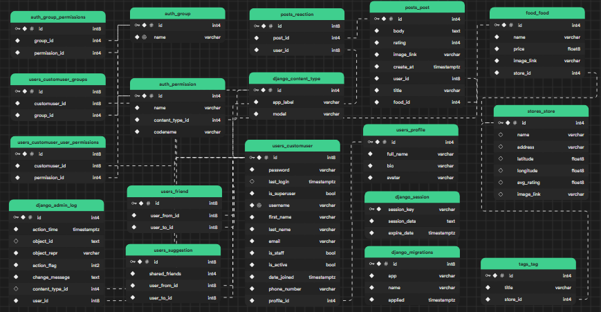

# Foodfeed Backend Server
## Technologies
Storage: PostgreSQL (Database) + S3 Bucket (File blobs) + Redis (In-memory caching)

Data Retrieval: BeautifulSoup + Selenium, crawled 29558 shops and 712,733 food items around Ho Chi Minh City

API Deployment: Django

Server Deployment: Docker, AWS EC2 - Ubuntu Instance

## Instruction

0. Put the private files into folder foodfeed_app (.env and .json files)

1. Update the conda

```
conda update --all
```

3. Create a new virtual environment with Python and activate it.

```
cd Backend/
python -m venv env
source env/bin/activate
```

**Suggestion**: Using `conda`  if you don't want to use Python venv.
```
conda create -n backend
conda activate backend
```

2. Install the dependencies (The hardest one)

```
conda install -r requirements.txt
```

- if the installation fails, run the below code to check missing modules.

  ```
  python manage.py runserver
  ```

  Some modules may occur for installation.

  ```
  pip install python-dotenv supabase psycopg2-binary django-cors-headers geopy redis
  ```

3. Run the application (make sure you have PostgreSQL running on your machine and please change the database settings in settings.py to your own database settings...)

    ```
    python manage.py makemigrations
    python manage.py migrate 
    python manage.py runserver
    ```
4. *(Optional - Should use when running on a server)* Deploy Backend on **ngrok**

- Open a new terminal and run **ngrok**:
    ```
    ngrok http 8000
    ```

- If not using **ngrok**, just use the localhost [http://127.0.0.1:8000/](http://127.0.0.1:8000/)

## Documentation


### /users
#### `/login`
Login to existing user in the database.
##### POST
```js
{
  email: "yangtuananh2003@gmail.com",
  password: 123456
}
```
returns
```js
{
  status: "You are now logged in
}
```

#### `/register`
Create new user in case they haven't existed in the database.
##### POST
```js
{
  full_name: "Yang Tuan Anh", 
  username: "yangtuananh", 
  email: "yangtuananh2003@gmail.com", 
  phone_number: 91311699, 
  password: 123456, 
  password2: 123456
}
```
if valid input and user hasnt existed, returns
```js
{
  status: "You are now logged in
}
```
as automatic login after successful registration

#### `/logout`
Logout of current session.
##### POST
```js
{
  status: "You are now logged out"
}
```
#### `/profile`
Login required, returns the profile of the currently logged in user.
##### PUT
```js
{
  full_name: "Yang Tuấn Anh",
  bio: "why would you buy a dragonfruit from Singapore just to show it off to your Vietnamese relatives as a Singaporean memorabilia",
  avatar_base64: "[base64 of image]",
  avatar_filename: "hetcuu.png"
}
```
returns
```js
{
  status: "Updated successfully"
}
```
##### GET
```js
{
  full_name: "Yang Tuấn Anh",
  bio: "why would you buy a dragonfruit from Singapore just to show it off to your Vietnamese relatives as a Singaporean memorabilia",
  avatar: "[s3 link of image]"
}
```
#### `/profile/<int:user_id>`
Returns the profile of a specified user id.
##### GET
```js
{
  full_name: "Yang Tuấn Anh",
  bio: "why would you buy a dragonfruit from Singapore just to show it off to your Vietnamese relatives as a Singaporean memorabilia",
  avatar: "[s3 link of image]"
}
```
#### `/friends`
##### GET
Returns a list of user objects which are friends to the authenticated user.
#### `/friends/<int:user_id>`
Returns a list of user objects which are friends to the user with given id.

#### `/friends/suggestions`
Returns 5 random users (TODO: Use BFS to find closely unfriended users)

### /posts
#### GET
#### POST
Login required. No input. If not friended, will add new connection between authenticated user and user with given user id. Else, then unfriend.
#### `/`
Returns current user's posts or submit new post.
##### GET
Returns
```js
[{
  id: 1,
  user: "yangtuananh2003",
  title: "Review cantin Sư Phạm",
  body: "ngon nhưng đông vl",
  rating: 5,
  username: "daothit",
  image_link: "[s3 link]",
  create_at: "[timedate]"
}, ...
]
```
##### POST
```js
{
  title: "Review cantin KHTN",
  body: "ngon qua", 
  rating: 5, 
  image_base64: "[base64 image]", 
  image_name: "khtn.png"
}
```
returns
```js
{
  status: "Created post 3743289"
}
```
#### `/<int:post_id>`
Returns post
##### GET
Returns
```js
{
  id: 1,
  user: "yangtuananh2003",
  title: "Review cantin Sư Phạm",
  body: "ngon nhưng đông vl",
  food_id: 123,
  rating: 5,
  image_link: "[s3 link]",
  create_at: "[timedate]"
}
```
Login required, only deletes posts that you made.

##### DELETE
```js
{
  status: "Deleted post 23493915"
}
```

#### `/reactions/<int:post_id>`
Returns reactions for a post
##### POST
No input, returns
```js
{
  status: "yangtuananh2003 reacted to 12375839"
}
```
if gave reaction, else if reacted
```js
{
  status: "Deleted reaction from 12375839"
}
```
##### GET
```js
{
  count: 100
}
```
#### `/reviews/<int:food_id>`
##### GET
Returns posts about that food item. Refer to `/<int:food_id>` for format.
### stores

### feed
#### `\`
##### GET
Returns the first 50 posts sorted by newest
### food

### tags
#### `\`
##### GET
Takes in `query`, returns:
```js
{
  id: 1,
  title: "com_ga",
  store: 24653
}
```
##### POST
Creates a new tag, if it hasnt existed yet. Input takes in `query`, `longitude`, `latitude`. Returns:
```js
{
  status: "#com_ga was created with store $Dịch Vụ Đám Tiệc Ba Thu"
} 
```